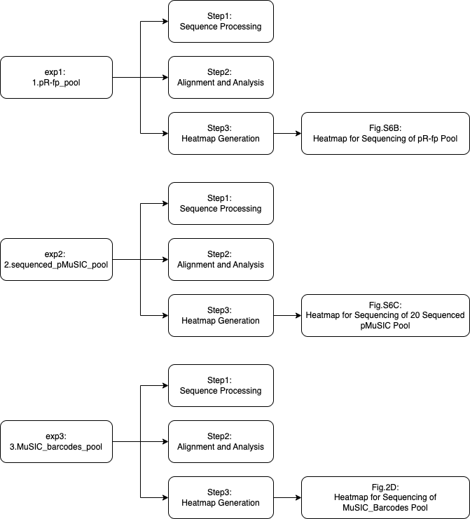

# **Installation**
For specific Python packages, a requirements file has been provided at 'requirements.txt'.
Assuming Pythonis installed, run the following command to install all necessary dependencies:
```
pip install -r requirements.txt
```

# **Usage**
All original files and the result files were available upon request due to size limitations.

To use the project, you can use the run_all.py file in the terminal for both top-level direction for complete functionality, or you can test each experiment individually for specific tasks.
All experiments and their steps are organized as shown in the structure tree. 





# **Running the Full Operation**
python run_all.py --experiment all --step all

## **Running Individual Experiment:**
```
python run_all.py --experiment exp1  --step all
python run_all.py --experiment exp2  --step all
python run_all.py --experiment exp3  --step all
```

## **Running Individual Scripts:**
```
python run_all.py --experiment exp1  --step Step1
python run_all.py --experiment exp1  --step Step2
python run_all.py --experiment exp1  --step Step3
```

To run other experiments, simply replace exp1 with the desired experiment name, such as exp2 or exp3. 
To view Step 2 or Step 3 of one experiment, you should first run the previous step(s); otherwise, you won't be able to directly access the results of the prior step locally.
